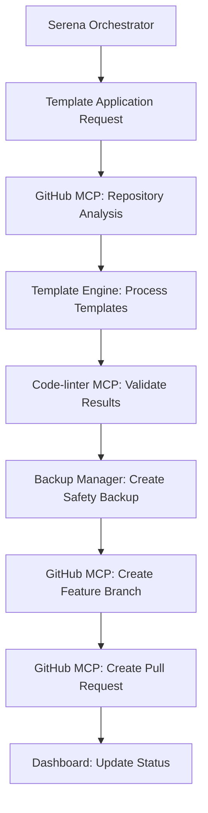

# Phase 1B Production Deployment Plan

## Current Status
- **Phase 1B Template Application Engine**: ✅ Fully implemented and tested
- **All Bugs Fixed**: ✅ Backup manager, batch processor, CLI scripts
- **Testing Completed**: ✅ Dry-run, application, rollback, batch processing
- **Ready for Production**: ✅ All components validated

## Deployment Strategy

### 1. Pre-Deployment Validation
- **Code Quality**: Run code-linter MCP validation on all Phase 1B files
- **Integration Testing**: Verify MCP server integration paths
- **Backup Strategy**: Ensure rollback capability for production deployment

### 2. Production Environment Integration
- **Target Server**: 192.168.1.58 (LXC Container)
- **Base Directory**: `/opt/gitops/`
- **Integration Points**: 
  - Existing GitOps Auditor API (port 3070)
  - Dashboard frontend integration
  - systemd service configuration

### 3. Template System Deployment
- **Deploy Core Components**:
  - `.mcp/template-applicator.py` → Template application engine
  - `.mcp/backup-manager.py` → Backup and rollback system
  - `.mcp/batch-processor.py` → Parallel processing engine
  - `.mcp/conflict-resolver.py` → Intelligent conflict resolution
  - `.mcp/templates/` → Standard DevOps template library

- **Deploy CLI Interfaces**:
  - `scripts/apply-template.sh` → Single repository operations
  - `scripts/batch-apply-templates.sh` → Multi-repository batch operations

### 4. GitHub MCP Integration
- **Repository Operations**: Template applications create feature branches
- **Pull Request Automation**: Automated PR creation for template updates
- **Issue Tracking**: Integration with existing GitOps audit findings

### 5. Dashboard Integration Points
- **Template Status Panel**: Add to existing dashboard
- **Repository Template Compliance**: New audit metric
- **Template Application History**: Track deployment results

## Deployment Phases

### Phase 1B.1: Core Infrastructure (Priority: High)
1. **Deploy Template Application Engine** to production server
2. **Integrate with existing API endpoints** (port 3070)
3. **Configure systemd service updates** for template functionality
4. **Validate backup and rollback systems**

### Phase 1B.2: CLI Integration (Priority: High)  
1. **Deploy CLI wrapper scripts** to production
2. **Configure environment variables** for production paths
3. **Test template application workflows** on development repositories
4. **Validate GitHub MCP integration** for automated PRs

### Phase 1B.3: Dashboard Integration (Priority: Medium)
1. **Add template status API endpoints** to existing API
2. **Create template compliance widgets** for dashboard
3. **Integrate template metrics** with existing audit reports
4. **Deploy dashboard updates** to production frontend

### Phase 1B.4: Production Validation (Priority: High)
1. **Run comprehensive integration tests** on production server
2. **Validate all MCP server connections** (GitHub, Code-linter, etc.)
3. **Test template applications** on select development repositories
4. **Verify monitoring and logging** integration

## MCP Server Orchestration Strategy

### Primary Workflow (Serena-Orchestrated)


### Integration Points
- **GitHub MCP**: Repository operations, branch management, PR creation
- **Code-linter MCP**: Pre-commit validation of template results
- **Filesystem MCP**: Enhanced file operations and validation
- **Existing GitOps API**: Template status and compliance reporting

## Production Configuration

### Environment Variables
```bash
# Phase 1B Template Configuration
TEMPLATE_APPLICATION_MODE=production
TEMPLATE_BACKUP_DIR=/opt/gitops/.mcp/backups
TEMPLATE_BATCH_WORKERS=4
GITHUB_TEMPLATE_INTEGRATION=enabled
CODE_LINTER_VALIDATION=required

# GitOps Integration
GITOPS_API_ENDPOINT=http://192.168.1.58:3070
TEMPLATE_STATUS_ENDPOINT=/api/template-status
TEMPLATE_COMPLIANCE_ENDPOINT=/api/template-compliance
```

### Service Integration
```bash
# Update existing systemd service
sudo systemctl edit gitops-audit-api
# Add Phase 1B template functionality

# New template-specific service (optional)
sudo systemctl enable gitops-template-engine
sudo systemctl start gitops-template-engine
```

## Risk Mitigation

### Rollback Strategy
1. **Comprehensive Backups**: Pre-deployment system snapshots
2. **Git Stash Strategy**: Safe handling of uncommitted changes
3. **Service Rollback**: Quick revert to previous systemd configuration
4. **Database Rollback**: Template operation history and audit trails

### Validation Checkpoints
1. **Pre-deployment**: All tests pass, MCP servers responding
2. **Post-deployment**: Template operations functional, APIs responding
3. **Integration**: Dashboard updates working, GitHub PR creation verified
4. **Production**: Real template applications successful on test repositories

## Success Metrics

### Technical Metrics
- **Template Application Success Rate**: >95% for standard-devops template
- **Backup and Rollback Functionality**: 100% operational
- **API Response Times**: <500ms for template status endpoints
- **GitHub Integration**: Automated PR creation >90% success rate

### Business Metrics
- **Repository Compliance**: Increase in MCP-configured repositories
- **Developer Adoption**: Template usage across development repositories
- **Operational Efficiency**: Reduced manual repository configuration time

## Next Steps After Deployment

### Phase 1C: Advanced Features
- **Custom Template Creation**: Wizard for project-specific templates
- **Template Versioning**: Update propagation and dependency management
- **Advanced Conflict Resolution**: UI-driven conflict resolution
- **Template Analytics**: Usage patterns and success metrics

### Integration Expansion
- **WikiJS Integration**: Template-generated documentation upload
- **Proxmox Integration**: Template applications for infrastructure repos
- **Home Assistant Integration**: DevOps templates for automation projects

This deployment plan ensures Phase 1B Template Application Engine integrates seamlessly with existing production infrastructure while maintaining system reliability and enabling advanced GitOps automation workflows.