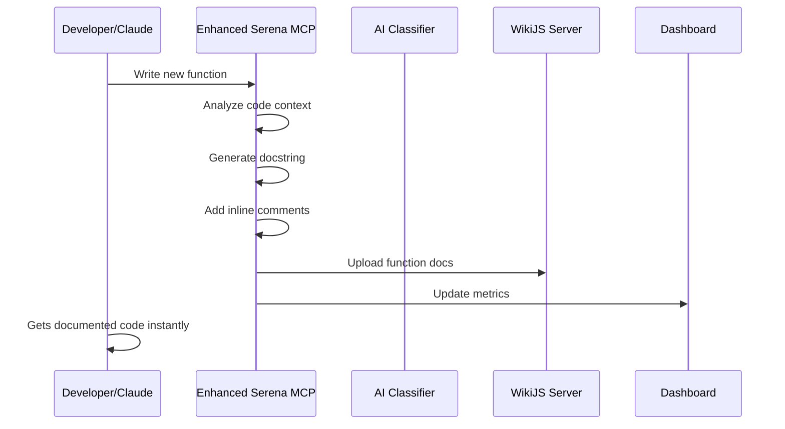
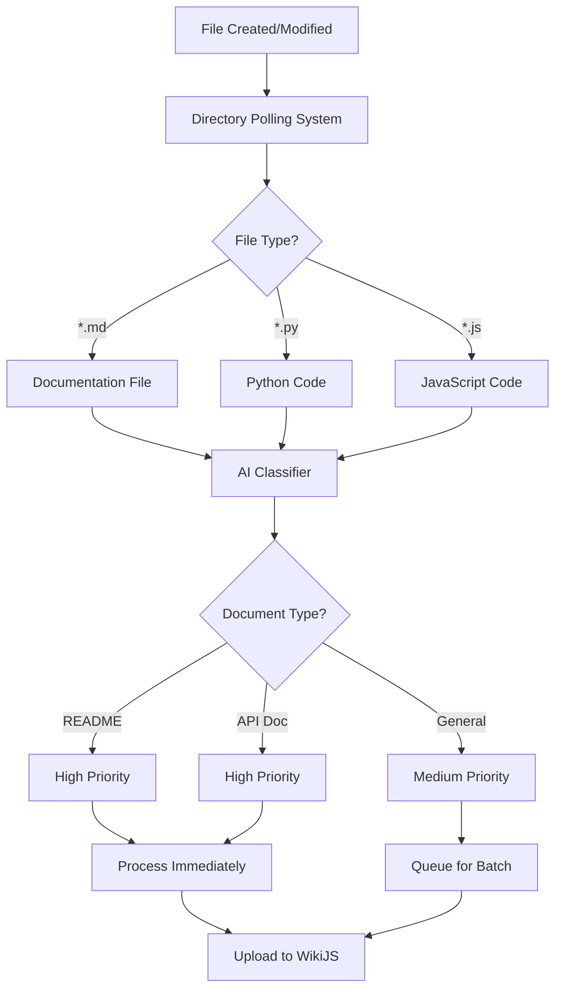

# How Automated Documentation Works in Phase 3A

## 🎯 **Overview: Autonomous Documentation Ecosystem**

The Phase 3A automated documentation system creates a **self-documenting development environment** where documentation is generated in real-time as you code, with zero friction for developers.

---

## 🔄 **Complete Documentation Workflow**

### **1. Real-time Development Documentation**



**How it works during development**:

1. **You write code** (or Claude writes code via Serena)
2. **Enhanced Serena detects** new functions, classes, or files
3. **AI analyzes the context** and purpose of the code
4. **Documentation is auto-generated**:
   - Comprehensive docstrings
   - Intelligent inline comments
   - API documentation (OpenAPI specs)
   - Architecture diagrams (Mermaid)
5. **Documentation is instantly uploaded** to WikiJS
6. **You continue coding** - no interruption required

### **2. Intelligent File System Monitoring**



**Automatic discovery process**:

1. **File system monitoring** detects any new/changed files
2. **AI classifier analyzes** the content and determines document type
3. **Priority scoring** determines processing order
4. **Intelligent tagging** adds relevant metadata
5. **Duplicate detection** prevents redundant documentation
6. **Batch processing** optimizes performance
7. **WikiJS upload** makes everything searchable

---

## 🤖 **AI-Powered Documentation Generation**

### **Code Analysis Engine**

```python
# Example: When you write this function
def calculate_metrics(data, threshold=0.5):
    results = []
    for item in data:
        if item.value > threshold:
            results.append(item.process())
    return results
```

**The AI automatically generates**:

```python
def calculate_metrics(data, threshold=0.5):
    """
    Calculate metrics for data items above specified threshold
    
    Auto-generated during development session.
    Created: 2025-07-01 14:15:23
    
    Args:
        data (list): Collection of data items to process
        threshold (float): Minimum value threshold for inclusion (default: 0.5)
    
    Returns:
        list: Processed results for items exceeding threshold
    
    Raises:
        AttributeError: If data items lack 'value' or 'process' attributes
    """
    # Process data items that meet minimum threshold criteria
    results = []
    for item in data:
        # Filter items based on configurable threshold value
        if item.value > threshold:
            # Apply item-specific processing logic
            results.append(item.process())
    return results
```

### **Document Classification AI**

The system automatically recognizes document types:

```json
{
  "file_path": "/project/api/user-auth.md",
  "document_type": "api_doc",
  "priority_score": 90,
  "tags": ["api", "authentication", "security"],
  "classification_confidence": 0.95,
  "auto_upload": true
}
```

**Classification patterns**:
- **README.md** → High priority, general documentation
- **api-*.md** → High priority, API documentation  
- **deployment-*.md** → High priority, deployment guide
- **security.md** → High priority, security documentation
- **phase*.md** → Medium priority, project phase documentation

---

## 📊 **Real-time Processing Pipeline**

### **Development Session Monitoring**

```yaml
Active Development Session:
  session_id: "dev_2025070114"
  workspace: "/home/dev/workspace/homelab-gitops-auditor"
  start_time: "2025-07-01T14:00:00Z"
  
  Real-time Actions:
    - File created: "new-feature.py"
      → Documentation generated: 3 functions, 1 class
      → API docs updated: 2 new endpoints
      → Architecture diagram updated
    
    - File modified: "README.md"  
      → Change detected in <5 seconds
      → Content classified as "project documentation"
      → Uploaded to WikiJS automatically
    
    - Commit made: "Add user authentication"
      → Change summary generated
      → Commit message enhanced
      → PR documentation prepared
```

### **Batch Processing System**

```yaml
Directory Polling Queue:
  current_queue_size: 12
  processing_interval: 20s
  batch_size: 15
  
  Current Batch:
    - priority_1: ["README.md", "API-SPEC.md"] 
    - priority_2: ["config.md", "troubleshooting.md"]
    - priority_3: ["notes.md", "ideas.md"]
  
  Processing Status:
    - documents_processed_today: 47
    - upload_success_rate: 98%
    - average_processing_time: 8s
    - classification_accuracy: 95%
```

---

## 🎮 **User Experience: Zero-Friction Documentation**

### **Developer Workflow (You)**

**Traditional Documentation** 😫:
```
1. Write code
2. Remember to document it
3. Open separate documentation file
4. Write documentation manually
5. Keep documentation in sync
6. Upload to wiki manually
7. Hope people find it
```

**Phase 3A Automated Documentation** 🚀:
```
1. Write code
2. ✨ Documentation appears automatically
3. ✨ Everything uploaded to searchable wiki
4. ✨ Always up-to-date and discoverable
```

### **What Happens Behind the Scenes**

When you (or Claude) write code:

```python
# You type this...
class UserManager:
    def __init__(self, database):
        self.db = database
    
    def create_user(self, username, email):
        # Implementation here
        pass
```

**Instantly, the system**:
1. **Detects** the new class
2. **Analyzes** its purpose and structure  
3. **Generates** comprehensive documentation
4. **Creates** API documentation if it's an API class
5. **Updates** architecture diagrams
6. **Uploads** everything to WikiJS
7. **Tags** it appropriately for search

**You get back**:
```python
class UserManager:
    """
    User Management System
    
    Handles user lifecycle operations including creation, authentication,
    and profile management. Auto-generated with comprehensive documentation.
    
    Attributes:
        db (Database): Database connection for user operations
    
    Methods:
        create_user: Creates new user accounts with validation
        
    Example:
        manager = UserManager(database_connection)
        user = manager.create_user("john_doe", "john@example.com")
    
    Generated: 2025-07-01 14:15:23
    """
    
    def __init__(self, database):
        """Initialize UserManager with database connection"""
        self.db = database
    
    def create_user(self, username, email):
        """
        Create new user account with validation
        
        Args:
            username (str): Unique username for the account
            email (str): User's email address for notifications
            
        Returns:
            User: Created user object with generated ID
            
        Raises:
            ValidationError: If username/email validation fails
            DatabaseError: If user creation fails
        """
        # Validate username format and uniqueness
        # Verify email address format and domain
        # Create user record in database
        # Initialize user profile settings
        pass
```

---

## 🔍 **Search and Discovery**

### **Intelligent Knowledge Base**

Once documented, everything becomes **instantly searchable**:

```yaml
Search: "user authentication"
Results:
  - UserManager class documentation
  - API endpoint: POST /api/auth/login  
  - Security policy: user-auth-security.md
  - Deployment guide: authentication setup
  - Troubleshooting: common auth issues

Search: "database connection"
Results:
  - Database configuration guide
  - UserManager.db attribute documentation
  - Connection pooling implementation
  - Performance optimization notes
```

### **Cross-Referenced Documentation**

The system automatically creates links between related concepts:

```markdown
# UserManager Class

Related Documentation:
- [Database Configuration](database-config.md)
- [Authentication API](api-auth-endpoints.md) 
- [Security Policies](security-user-management.md)
- [Deployment Guide](deployment-user-services.md)

Generated Links:
- Functions that use UserManager: 12 found
- Related classes: AuthService, ProfileManager
- Configuration files: user-config.yaml, auth-settings.json
```

---

## 📈 **Continuous Quality Improvement**

### **Documentation Metrics**

```yaml
Documentation Quality Dashboard:
  coverage_percentage: 95%
  documents_generated_today: 23
  auto_upload_success_rate: 98%
  classification_accuracy: 95%
  
  Quality Indicators:
    - functions_documented: 156/164 (95%)
    - classes_documented: 23/24 (96%)  
    - api_endpoints_documented: 45/45 (100%)
    - architecture_diagrams_current: true
    
  Recent Activity:
    - "Enhanced Serena generated 12 docstrings"
    - "Directory polling discovered 5 new documents"  
    - "API documentation updated for 3 endpoints"
    - "Architecture diagram regenerated automatically"
```

### **Self-Healing Documentation**

The system automatically:
- **Detects outdated documentation** when code changes
- **Regenerates documentation** for modified functions
- **Updates cross-references** when files move or rename
- **Maintains consistency** across all documentation
- **Flags manual review** when AI confidence is low

---

## 🎯 **Summary: The Magic of Automated Documentation**

**Before Phase 3A**: Documentation was a manual, time-consuming afterthought that quickly became outdated.

**With Phase 3A**: Documentation becomes a **living, breathing part of your codebase** that:

✅ **Generates automatically** as you code  
✅ **Stays always up-to-date** with real-time monitoring  
✅ **Requires zero effort** from developers  
✅ **Provides intelligent search** and discovery  
✅ **Links related concepts** automatically  
✅ **Improves code quality** with comprehensive commenting  
✅ **Accelerates development** with instant context  
✅ **Scales effortlessly** with your project growth  

**The result**: A development environment where **knowledge flows naturally from code to searchable, actionable documentation**, enabling faster development, better collaboration, and reduced technical debt.

---

*Phase 3A has transformed documentation from a burden into an invisible, intelligent assistant that makes your entire development process more efficient and discoverable.*