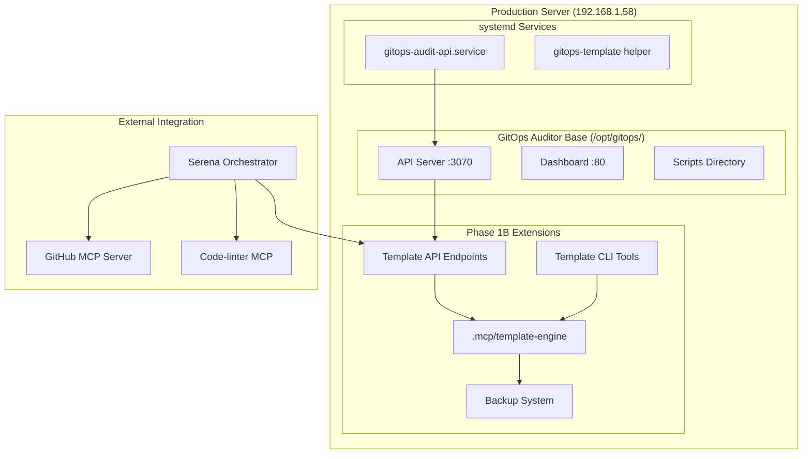

# Phase 1B Production Deployment Guide

## Overview

Phase 1B Template Application Engine production deployment integrates seamlessly with the existing GitOps Auditor infrastructure on production server `192.168.1.58`. This deployment extends the current API and dashboard with comprehensive template management capabilities.

## Deployment Architecture



## Deployment Scripts

### 1. Complete Deployment Orchestrator
```bash
./scripts/deploy-phase1b-complete.sh
```
**Purpose**: Master orchestration script that executes all deployment phases automatically.

**Features**:
- Pre-deployment validation
- Phase-by-phase execution with error handling
- Post-deployment validation
- Comprehensive status reporting
- Manual mode option (`--manual`)

### 2. Individual Phase Scripts

#### Phase 1B.1: Core Infrastructure
```bash
./scripts/deploy-phase1b-production.sh
```
- Deploys `.mcp/` components (template-applicator, backup-manager, batch-processor, conflict-resolver)
- Creates directory structure and sets permissions
- Deploys template library (standard-devops template)
- Configures production environment variables

#### Phase 1B.2: API Integration
```bash
./scripts/integrate-phase1b-api.sh
```
- Creates template API endpoints module
- Integrates with existing API server
- Adds template management routes
- Tests API functionality

#### Phase 1B.3: systemd Configuration
```bash
./scripts/configure-phase1b-systemd.sh
```
- Updates systemd service configuration
- Creates `gitops-template` management helper
- Configures log rotation
- Restarts services with new configuration

#### Phase 1B.4: Deployment Validation
```bash
./scripts/validate-phase1b-deployment.sh
```
- Validates all deployed components
- Tests API endpoints
- Verifies service integration
- Confirms functionality

## API Endpoints

Phase 1B adds the following template management endpoints to the existing API at `http://192.168.1.58:3070`:

### Template Management
- **GET** `/api/templates` - List available templates
- **GET** `/api/templates/:templateName` - Get specific template details
- **GET** `/api/templates/status` - Template system status

### Template Operations
- **POST** `/api/templates/apply` - Apply template to repository
  ```json
  {
    "templateName": "standard-devops",
    "repositoryPath": "/path/to/repo",
    "dryRun": true,
    "options": { "verbose": true }
  }
  ```

- **POST** `/api/templates/batch-apply` - Batch apply to multiple repositories
  ```json
  {
    "templateName": "standard-devops",
    "repositories": ["/path/repo1", "/path/repo2"],
    "dryRun": true,
    "options": { "workers": 4 }
  }
  ```

### Monitoring & History
- **GET** `/api/templates/history` - Template application history
- **GET** `/api/repositories/template-compliance` - Repository compliance status
- **GET** `/api/repositories/:repoName/template-status` - Specific repository status

### Backup & Recovery
- **GET** `/api/templates/backups` - List available backups
- **POST** `/api/templates/rollback` - Rollback template changes
  ```json
  {
    "backupId": "backup-id-here",
    "targetPath": "/path/to/restore"
  }
  ```

## CLI Tools

### gitops-template Management Helper

Installed at `/usr/local/bin/gitops-template` on production server.

**Commands**:
```bash
# System status and information
gitops-template status          # Show template engine status
gitops-template templates       # List available templates
gitops-template test           # Test all components

# Template operations
gitops-template apply <template> <repo>     # Apply template (dry-run)
gitops-template batch-apply <template> ... # Batch apply to multiple repos

# Backup and recovery
gitops-template backup <repo>              # Create repository backup
gitops-template restore <backup-id>        # Restore from backup

# Service management
gitops-template logs           # View service logs
gitops-template restart        # Restart template engine
```

### Direct Script Access
```bash
# Single repository operations
bash scripts/apply-template.sh --dry-run standard-devops /path/to/repo
bash scripts/apply-template.sh --apply standard-devops /path/to/repo

# Batch operations
bash scripts/batch-apply-templates.sh --dry-run standard-devops
bash scripts/batch-apply-templates.sh --apply --workers 2 standard-devops
```

## Templates

### Standard DevOps Template
**Location**: `/opt/gitops/.mcp/templates/standard-devops/`

**Files Created**:
- `.mcp.json` - MCP server configuration
- `CLAUDE.md` - Project documentation template
- `scripts/` - Scripts directory
- `.gitignore` - Updated with DevOps patterns

**Use Cases**:
- New repository setup
- MCP integration standardization
- DevOps best practices enforcement

## Production Configuration

### Environment Variables
Located in `/opt/gitops/.env`:

```bash
# Phase 1B Template Engine Configuration
TEMPLATE_APPLICATION_MODE=production
TEMPLATE_BACKUP_DIR=/opt/gitops/.mcp/backups
TEMPLATE_BATCH_WORKERS=4
TEMPLATE_OPERATION_LOGS=/opt/gitops/logs/template-operations

# GitOps Integration
GITOPS_API_ENDPOINT=http://192.168.1.58:3070
GITOPS_BASE_DIR=/opt/gitops

# GitHub MCP Integration
GITHUB_TEMPLATE_INTEGRATION=enabled
GITHUB_BRANCH_PREFIX=template-application

# Code Quality Enforcement
CODE_LINTER_VALIDATION=required
PRE_COMMIT_VALIDATION=enabled

# Production Safety
REQUIRE_BACKUP_BEFORE_APPLY=true
DEFAULT_DRY_RUN=true
ENABLE_ROLLBACK=true
```

### Service Configuration
Updated `/etc/systemd/system/gitops-audit-api.service`:

```ini
[Unit]
Description=GitOps Auditor API Server with Phase 1B Template Engine
After=network.target

[Service]
Type=simple
User=root
WorkingDirectory=/opt/gitops
EnvironmentFile=/opt/gitops/.env
ExecStart=/usr/bin/node api/server.js
Restart=always
RestartSec=10

# Phase 1B Environment
Environment=TEMPLATE_APPLICATION_MODE=production
Environment=ENABLE_TEMPLATE_ENGINE=true

[Install]
WantedBy=multi-user.target
```

## MCP Server Integration

### Serena Orchestration
Phase 1B follows Serena orchestration principles:

1. **Planning Phase**: Serena coordinates template selection and target analysis
2. **Validation Phase**: Code-linter MCP validates all template results
3. **Application Phase**: Template engine applies changes with backup creation
4. **Integration Phase**: GitHub MCP creates feature branches and pull requests
5. **Monitoring Phase**: Dashboard integration tracks template compliance

### GitHub MCP Workflow
```bash
# Template application creates:
# 1. Feature branch: template-application/standard-devops-YYYYMMDD
# 2. Template changes committed to branch
# 3. Pull request created for review
# 4. Integration with existing GitOps audit findings
```

### Code Quality Integration
- All template results validated by code-linter MCP
- Pre-commit hooks enforce template compliance
- Quality gates prevent non-compliant deployments

## Monitoring & Maintenance

### Health Checks
```bash
# Service status
systemctl status gitops-audit-api

# API health
curl http://192.168.1.58:3070/api/templates/status

# Component test
gitops-template test
```

### Log Locations
- **Service Logs**: `journalctl -u gitops-audit-api`
- **Template Operations**: `/opt/gitops/logs/template-operations/`
- **Backup Logs**: `/opt/gitops/.mcp/backups/`

### Backup Management
```bash
# List backups
python3 .mcp/backup-manager.py list

# Create backup
python3 .mcp/backup-manager.py create --repository /path/to/repo --type full

# Restore backup
python3 .mcp/backup-manager.py restore --backup-id backup-id-here
```

## Security Considerations

### Access Control
- Template operations require root access on production server
- API endpoints validate request parameters
- Backup system creates secure snapshots before changes

### Safety Features
- Default dry-run mode prevents accidental changes
- Comprehensive backup system with rollback capability
- Git integration preserves change history
- Validation checkpoints at each deployment phase

### Network Security
- Template operations confined to internal network (192.168.1.0/24)
- API endpoints accessible only through existing GitOps infrastructure
- SSH key authentication required for deployment

## Troubleshooting

### Common Issues

1. **Service Won't Start**
   ```bash
   journalctl -u gitops-audit-api --no-pager -l
   systemctl status gitops-audit-api
   ```

2. **API Not Responding**
   ```bash
   curl -v http://192.168.1.58:3070/audit
   netstat -tlnp | grep 3070
   ```

3. **Template Operations Failing**
   ```bash
   gitops-template test
   python3 .mcp/template-applicator.py list
   ```

4. **Backup Issues**
   ```bash
   python3 .mcp/backup-manager.py validate --backup-id <id>
   ls -la /opt/gitops/.mcp/backups/
   ```

### Recovery Procedures

1. **Service Recovery**
   ```bash
   systemctl stop gitops-audit-api
   # Restore from backup if needed
   systemctl start gitops-audit-api
   ```

2. **Template System Recovery**
   ```bash
   # Restore .mcp directory from backup
   cp -r /opt/gitops/backups/latest/.mcp /opt/gitops/
   systemctl restart gitops-audit-api
   ```

3. **Complete Rollback**
   ```bash
   # Use deployment backup created before Phase 1B
   # Restore entire /opt/gitops directory
   # Restore systemd service configuration
   ```

## Performance Optimization

### Batch Processing
- Default workers: 4 (configurable via `TEMPLATE_BATCH_WORKERS`)
- Recommended for production: 2-6 workers based on system resources
- Memory usage: ~50MB per worker process

### Storage Management
- Backup retention: 30 days, 10 backups per repository (configurable)
- Automatic cleanup prevents disk space issues
- Template operations logged with rotation

### Network Optimization
- Local template operations minimize network overhead
- GitHub MCP operations respect API rate limits
- Batch operations group network requests efficiently

## Future Enhancements

### Phase 1C: Dashboard Integration
- Template management UI in main dashboard
- Visual template compliance reporting
- Interactive template application wizard

### Phase 1D: Advanced Templates
- Custom template creation tools
- Template versioning and updates
- Cross-repository dependency management

### Phase 2: Enterprise Features
- Multi-server template deployment
- Advanced conflict resolution UI
- Template marketplace integration

---

**Deployment Status**: Ready for Production  
**Version**: 1.0.0  
**Last Updated**: 2025-07-01  
**Deployment Target**: 192.168.1.58:/opt/gitops/