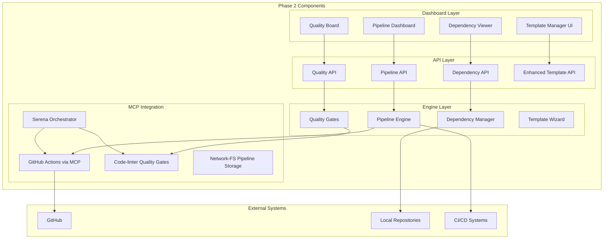

# Phase 2: Advanced DevOps Platform Features - Deployment Guide

## Overview

Phase 2 transforms the GitOps Auditor into a comprehensive DevOps platform by adding four major components:

1. **Advanced Dashboard Integration** - Enhanced UI for template and pipeline management
2. **CI/CD Pipeline Management** - Full DevOps platform capabilities  
3. **Cross-Repository Coordination** - Managing dependencies across multiple repos
4. **Quality Gate Enforcement** - Automated validation pipelines

## Architecture Overview



## Phase 2 Components Detail

### 2.1 Advanced Dashboard Integration

#### New Dashboard Routes
- `/templates` - Interactive template management interface
- `/pipelines` - CI/CD pipeline visualization and control
- `/dependencies` - Cross-repository dependency graph
- `/quality` - Quality metrics and gate status

#### Enhanced UI Components
```typescript
// New components to be created
dashboard/src/components/
├── TemplateWizard.tsx        // Step-by-step template application
├── PipelineBuilder.tsx       // Drag-and-drop pipeline designer
├── DependencyGraph.tsx       // D3.js dependency visualization
├── QualityMetrics.tsx        // Quality gate status cards
├── PipelineStatus.tsx        // Real-time pipeline execution
└── RepositoryRelations.tsx   // Cross-repo relationship viewer
```

### 2.2 CI/CD Pipeline Management

#### Pipeline Engine Structure
```
.mcp/pipeline-engine/
├── pipeline-orchestrator.py   # Core orchestration engine
├── pipeline-executor.py       # Pipeline execution logic
├── github-actions-bridge.py   # GitHub Actions integration
├── pipeline-monitor.py        # Status tracking and updates
└── templates/
    ├── node-ci.yaml          # Node.js CI/CD template
    ├── python-ci.yaml        # Python CI/CD template
    ├── docker-build.yaml     # Docker build pipeline
    └── multi-stage.yaml      # Multi-stage deployment
```

#### Pipeline Definition Format
```yaml
name: "Full Stack Application Pipeline"
version: "2.0"
triggers:
  - push:
      branches: [main, develop]
  - pull_request:
      types: [opened, synchronize]

stages:
  - name: quality-check
    parallel: true
    jobs:
      - linting:
          mcp: code-linter
          config: .eslintrc.js
      - security:
          mcp: security-scanner
          level: medium
      
  - name: build
    jobs:
      - compile:
          script: npm run build
          cache: node_modules
      
  - name: test
    jobs:
      - unit-tests:
          script: npm test
          coverage: 80%
      
  - name: deploy
    condition: branch == 'main'
    jobs:
      - production:
          mcp: github
          action: create-release
```

### 2.3 Cross-Repository Coordination

#### Dependency Management System
```
.mcp/dependency-manager/
├── dependency-scanner.py      # Scans repos for dependencies
├── dependency-resolver.py     # Resolves dependency conflicts
├── impact-analyzer.py        # Analyzes change impacts
├── coordination-engine.py    # Coordinates multi-repo ops
└── graph-builder.py         # Builds dependency graphs
```

#### Dependency Tracking Schema
```python
# Dependency types supported
DEPENDENCY_TYPES = {
    'npm': 'package.json dependencies',
    'git': 'Git submodules',
    'docker': 'Docker image dependencies',
    'api': 'API endpoint dependencies',
    'config': 'Shared configuration files',
    'data': 'Shared data sources'
}

# Dependency relationship model
class Dependency:
    source_repo: str
    target_repo: str
    dependency_type: str
    version_constraint: str
    impact_level: str  # critical, high, medium, low
    last_validated: datetime
```

### 2.4 Quality Gate Enforcement

#### Quality Gate Framework
```
.mcp/quality-gates/
├── gate-definitions/
│   ├── code-quality.yaml     # Linting and formatting rules
│   ├── test-coverage.yaml    # Test coverage requirements
│   ├── security-scan.yaml    # Security vulnerability checks
│   └── performance.yaml      # Performance benchmarks
├── gate-executor.py          # Executes quality checks
├── gate-reporter.py          # Generates quality reports
└── enforcement-engine.py     # Enforces gate requirements
```

#### Quality Gate Configuration
```yaml
quality_gates:
  pre_commit:
    - name: "Code Linting"
      mcp: code-linter
      required: true
      fail_threshold: "error"
    
    - name: "Format Check"
      command: "prettier --check"
      required: true
  
  pre_merge:
    - name: "Test Coverage"
      minimum: 80
      required: true
    
    - name: "Security Scan"
      mcp: security-scanner
      severity: "medium"
    
    - name: "Documentation"
      check: "README.md exists"
      required: true
  
  pre_deploy:
    - name: "Performance Test"
      baseline: "previous_release"
      tolerance: 10
    
    - name: "Integration Tests"
      required: true
      timeout: 300
```

## Database Schema Extensions

```sql
-- Pipeline definitions and history
CREATE TABLE pipelines (
    id TEXT PRIMARY KEY,
    name TEXT NOT NULL,
    repository_id TEXT NOT NULL,
    definition JSON NOT NULL,
    version TEXT NOT NULL,
    created_at TIMESTAMP DEFAULT CURRENT_TIMESTAMP,
    updated_at TIMESTAMP DEFAULT CURRENT_TIMESTAMP,
    created_by TEXT,
    status TEXT DEFAULT 'active'
);

CREATE TABLE pipeline_runs (
    id TEXT PRIMARY KEY,
    pipeline_id TEXT NOT NULL,
    run_number INTEGER NOT NULL,
    status TEXT NOT NULL, -- pending, running, success, failed, cancelled
    started_at TIMESTAMP,
    completed_at TIMESTAMP,
    trigger_type TEXT, -- manual, push, schedule, webhook
    trigger_data JSON,
    execution_log TEXT,
    metrics JSON,
    FOREIGN KEY (pipeline_id) REFERENCES pipelines(id)
);

-- Repository dependencies
CREATE TABLE repository_dependencies (
    id TEXT PRIMARY KEY,
    source_repo TEXT NOT NULL,
    target_repo TEXT NOT NULL,
    dependency_type TEXT NOT NULL,
    version_constraint TEXT,
    impact_level TEXT DEFAULT 'medium',
    discovered_at TIMESTAMP DEFAULT CURRENT_TIMESTAMP,
    last_validated TIMESTAMP,
    metadata JSON
);

CREATE TABLE dependency_changes (
    id TEXT PRIMARY KEY,
    dependency_id TEXT NOT NULL,
    change_type TEXT NOT NULL, -- added, updated, removed
    old_version TEXT,
    new_version TEXT,
    detected_at TIMESTAMP DEFAULT CURRENT_TIMESTAMP,
    impact_analysis JSON,
    FOREIGN KEY (dependency_id) REFERENCES repository_dependencies(id)
);

-- Quality gate results
CREATE TABLE quality_gates (
    id TEXT PRIMARY KEY,
    name TEXT NOT NULL,
    gate_type TEXT NOT NULL, -- pre_commit, pre_merge, pre_deploy
    definition JSON NOT NULL,
    active BOOLEAN DEFAULT true,
    created_at TIMESTAMP DEFAULT CURRENT_TIMESTAMP
);

CREATE TABLE quality_results (
    id TEXT PRIMARY KEY,
    repository_id TEXT NOT NULL,
    gate_id TEXT NOT NULL,
    run_id TEXT, -- Links to pipeline_runs if applicable
    status TEXT NOT NULL, -- passed, failed, warning, skipped
    score REAL,
    metrics JSON,
    details TEXT,
    executed_at TIMESTAMP DEFAULT CURRENT_TIMESTAMP,
    FOREIGN KEY (gate_id) REFERENCES quality_gates(id)
);

-- Template usage tracking for Phase 2
CREATE TABLE template_metrics (
    id TEXT PRIMARY KEY,
    template_name TEXT NOT NULL,
    repository_id TEXT NOT NULL,
    compliance_score REAL,
    last_applied TIMESTAMP,
    drift_detected BOOLEAN DEFAULT false,
    metrics JSON
);
```

## API Endpoints

### Pipeline Management APIs
```javascript
// Pipeline CRUD operations
POST   /api/pipelines                    // Create new pipeline
GET    /api/pipelines                    // List all pipelines
GET    /api/pipelines/:id                // Get pipeline details
PUT    /api/pipelines/:id                // Update pipeline
DELETE /api/pipelines/:id                // Delete pipeline

// Pipeline execution
POST   /api/pipelines/:id/execute        // Execute pipeline
GET    /api/pipelines/:id/runs           // Get execution history
GET    /api/pipelines/:id/runs/:runId    // Get specific run details
POST   /api/pipelines/:id/runs/:runId/cancel  // Cancel running pipeline

// Pipeline templates
GET    /api/pipeline-templates            // List available templates
POST   /api/pipeline-templates/apply      // Apply template to repo
```

### Dependency Management APIs
```javascript
// Dependency discovery and tracking
POST   /api/dependencies/scan             // Scan repositories for dependencies
GET    /api/dependencies/graph            // Get dependency graph
GET    /api/dependencies/repository/:id   // Get repo dependencies

// Impact analysis
POST   /api/dependencies/analyze-impact   // Analyze change impact
GET    /api/dependencies/conflicts        // List dependency conflicts

// Coordination
POST   /api/dependencies/coordinate       // Coordinate multi-repo operation
GET    /api/dependencies/coordination/:id // Get coordination status
```

### Quality Gate APIs
```javascript
// Quality gate management
GET    /api/quality/gates                 // List quality gates
POST   /api/quality/gates                 // Create quality gate
PUT    /api/quality/gates/:id            // Update gate definition

// Quality validation
POST   /api/quality/validate              // Run quality validation
GET    /api/quality/results/:repoId       // Get quality results
GET    /api/quality/metrics               // Get quality metrics

// Quality reports
GET    /api/quality/reports/summary       // Summary report
GET    /api/quality/reports/trends        // Trend analysis
POST   /api/quality/reports/generate      // Generate custom report
```

### Enhanced Template APIs (Phase 2)
```javascript
// Template wizard support
GET    /api/templates/wizard/start        // Start wizard session
POST   /api/templates/wizard/preview      // Preview template changes
POST   /api/templates/wizard/apply        // Apply with wizard config

// Template compliance
GET    /api/templates/compliance          // Overall compliance status
GET    /api/templates/compliance/:repoId  // Repository compliance
POST   /api/templates/compliance/enforce  // Enforce compliance

// Template metrics
GET    /api/templates/metrics             // Template usage metrics
GET    /api/templates/drift               // Detect template drift
```

## MCP Server Integration Strategy

### Serena Orchestration Patterns

```python
# Example: Coordinated multi-repo pipeline execution
async def execute_coordinated_pipeline(repos: List[str], pipeline: str):
    """
    Use Serena to coordinate pipeline execution across multiple repositories
    """
    # 1. Analyze dependencies
    dependencies = await serena.analyze_dependencies(repos)
    
    # 2. Determine execution order
    execution_plan = await serena.create_execution_plan(
        repos=repos,
        dependencies=dependencies,
        pipeline=pipeline
    )
    
    # 3. Execute with GitHub MCP
    for phase in execution_plan.phases:
        results = await serena.execute_phase(
            phase=phase,
            mcp_servers=['github', 'code-linter'],
            parallel=phase.allow_parallel
        )
        
        # 4. Validate with code-linter MCP
        validation = await serena.validate_results(
            results=results,
            quality_gates=phase.quality_gates
        )
        
        if not validation.passed:
            await serena.rollback_phase(phase)
            break
```

### GitHub MCP Integration

```yaml
# GitHub Actions workflow managed by GitOps Auditor
name: GitOps Managed Pipeline
on:
  workflow_dispatch:
    inputs:
      pipeline_id:
        description: 'Pipeline ID from GitOps Auditor'
        required: true
      
jobs:
  execute:
    runs-on: ubuntu-latest
    steps:
      - name: Notify GitOps Auditor
        run: |
          curl -X POST ${{ secrets.GITOPS_URL }}/api/pipelines/${{ inputs.pipeline_id }}/webhook \
            -H "Authorization: Bearer ${{ secrets.GITOPS_TOKEN }}" \
            -d '{"event": "started", "run_id": "${{ github.run_id }}"}'
      
      - name: Execute Pipeline
        uses: homelab-gitops/pipeline-action@v2
        with:
          pipeline_id: ${{ inputs.pipeline_id }}
          gitops_url: ${{ secrets.GITOPS_URL }}
```

### Code-linter MCP Quality Gates

```python
# Quality gate enforcement via code-linter MCP
class QualityGateEnforcer:
    def __init__(self, linter_mcp):
        self.linter = linter_mcp
        
    async def enforce_pre_commit(self, files: List[str]) -> QualityResult:
        # Run linting via MCP
        lint_results = await self.linter.lint_files(
            files=files,
            config='.eslintrc.js',
            fix=False
        )
        
        # Check formatting
        format_results = await self.linter.check_format(
            files=files,
            formatter='prettier'
        )
        
        # Aggregate results
        return QualityResult(
            passed=lint_results.passed and format_results.passed,
            score=calculate_quality_score(lint_results, format_results),
            details={
                'linting': lint_results,
                'formatting': format_results
            }
        )
```

## Deployment Scripts

### Master Deployment Script
```bash
#!/bin/bash
# deploy-phase2-complete.sh - Master orchestration script for Phase 2

set -euo pipefail

# Configuration
PRODUCTION_SERVER="192.168.1.58"
DEPLOYMENT_USER="root"
DEPLOYMENT_DIR="/opt/gitops"
LOG_FILE="phase2-deployment-$(date +%Y%m%d_%H%M%S).log"

# Colors for output
GREEN='\033[0;32m'
BLUE='\033[0;34m'
YELLOW='\033[1;33m'
RED='\033[0;31m'
NC='\033[0m'

echo -e "${GREEN}🚀 Phase 2 Advanced DevOps Platform Deployment${NC}"
echo -e "${BLUE}Target: ${PRODUCTION_SERVER}:${DEPLOYMENT_DIR}${NC}"

# Phase 2.1: Dashboard UI Components
echo -e "\n${BLUE}[Phase 2.1]${NC} Deploying Dashboard UI Components..."
./scripts/deploy-dashboard-v2.sh

# Phase 2.2: Pipeline Engine
echo -e "\n${BLUE}[Phase 2.2]${NC} Deploying Pipeline Engine..."
./scripts/deploy-pipeline-engine.sh

# Phase 2.3: Dependency Management
echo -e "\n${BLUE}[Phase 2.3]${NC} Deploying Dependency Management..."
./scripts/deploy-dependencies.sh

# Phase 2.4: Quality Gates
echo -e "\n${BLUE}[Phase 2.4]${NC} Deploying Quality Gates..."
./scripts/deploy-quality-gates.sh

# Phase 2.5: API Integration
echo -e "\n${BLUE}[Phase 2.5]${NC} Integrating Phase 2 APIs..."
./scripts/integrate-phase2-api.sh

# Phase 2.6: Database Migration
echo -e "\n${BLUE}[Phase 2.6]${NC} Running Database Migrations..."
./scripts/migrate-phase2-db.sh

# Phase 2.7: Validation
echo -e "\n${BLUE}[Phase 2.7]${NC} Validating Phase 2 Deployment..."
./scripts/validate-phase2.sh

echo -e "\n${GREEN}✅ Phase 2 Deployment Complete!${NC}"
```

## Production Configuration

### Environment Variables (Phase 2)
```bash
# Pipeline Engine Configuration
PIPELINE_ENGINE_MODE=production
PIPELINE_WORKER_COUNT=4
PIPELINE_TIMEOUT_SECONDS=3600
PIPELINE_LOG_LEVEL=info

# Dependency Management
DEPENDENCY_SCAN_INTERVAL=3600
DEPENDENCY_CACHE_TTL=86400
DEPENDENCY_ANALYSIS_DEPTH=3

# Quality Gates
QUALITY_GATE_ENFORCEMENT=strict
QUALITY_GATE_CACHE_ENABLED=true
QUALITY_PRE_COMMIT_TIMEOUT=300
QUALITY_METRICS_RETENTION_DAYS=90

# GitHub Integration
GITHUB_ACTIONS_ENABLED=true
GITHUB_WORKFLOW_PREFIX=gitops-managed
GITHUB_STATUS_UPDATES=true

# Dashboard WebSocket
WEBSOCKET_PIPELINE_UPDATES=true
WEBSOCKET_QUALITY_METRICS=true
WEBSOCKET_MAX_CONNECTIONS=100
```

### systemd Service Updates
```ini
[Unit]
Description=GitOps Auditor API Server with Phase 2 DevOps Platform
After=network.target

[Service]
Type=simple
User=root
WorkingDirectory=/opt/gitops
EnvironmentFile=/opt/gitops/.env
Environment=NODE_ENV=production
Environment=ENABLE_PHASE2_FEATURES=true
ExecStartPre=/bin/mkdir -p /opt/gitops/logs/pipelines
ExecStartPre=/bin/mkdir -p /opt/gitops/.mcp/pipeline-runs
ExecStartPre=/bin/mkdir -p /opt/gitops/.mcp/quality-reports
ExecStart=/usr/bin/node api/server.js
Restart=always
RestartSec=10
StandardOutput=append:/opt/gitops/logs/gitops-api.log
StandardError=append:/opt/gitops/logs/gitops-api-error.log

[Install]
WantedBy=multi-user.target
```

## Monitoring and Maintenance

### Health Checks
```bash
# Check all Phase 2 components
curl http://192.168.1.58:3070/api/health/phase2

# Pipeline engine status
curl http://192.168.1.58:3070/api/pipelines/health

# Dependency scanner status
curl http://192.168.1.58:3070/api/dependencies/health

# Quality gate status
curl http://192.168.1.58:3070/api/quality/health
```

### Maintenance Tasks
```bash
# Clean up old pipeline runs
python3 .mcp/pipeline-engine/maintenance.py --cleanup-runs --days 30

# Refresh dependency cache
python3 .mcp/dependency-manager/maintenance.py --refresh-cache

# Generate quality report
python3 .mcp/quality-gates/maintenance.py --generate-report --format pdf
```

## Security Considerations

### Pipeline Execution Security
- Sandboxed execution environment
- Limited resource allocation per pipeline
- Secrets management integration
- Audit logging for all operations

### Quality Gate Security
- Signed gate definitions
- Tamper detection for quality configs
- Role-based gate management
- Compliance audit trail

### API Security Enhancements
- OAuth2 integration for API access
- Rate limiting per endpoint
- Request validation and sanitization
- Encrypted communication for MCP servers

## Performance Optimization

### Pipeline Performance
- Parallel stage execution
- Intelligent caching strategies
- Resource pooling for workers
- Optimized webhook handling

### Dashboard Performance
- Code splitting for Phase 2 components
- Lazy loading of heavy visualizations
- WebSocket connection pooling
- Efficient state management

### Database Performance
- Indexed queries for common operations
- Partitioned tables for historical data
- Query result caching
- Connection pooling

## Rollback Procedures

### Component Rollback
```bash
# Rollback specific component
./scripts/rollback-phase2-component.sh --component dashboard

# Full Phase 2 rollback
./scripts/rollback-phase2-complete.sh --backup-id phase2_backup_20250701
```

### Database Rollback
```sql
-- Rollback Phase 2 schema changes
DROP TABLE IF EXISTS pipeline_runs;
DROP TABLE IF EXISTS pipelines;
DROP TABLE IF EXISTS dependency_changes;
DROP TABLE IF EXISTS repository_dependencies;
DROP TABLE IF EXISTS quality_results;
DROP TABLE IF EXISTS quality_gates;
DROP TABLE IF EXISTS template_metrics;
```

## Success Metrics

### Deployment Validation
- [ ] All dashboard routes accessible
- [ ] Pipeline engine executing test pipelines
- [ ] Dependency graph generating correctly
- [ ] Quality gates enforcing on test repos
- [ ] API endpoints responding with correct data
- [ ] MCP server integrations functional
- [ ] WebSocket updates working
- [ ] Database migrations completed

### Performance Targets
- Pipeline execution: < 5 second startup
- Dashboard load time: < 2 seconds
- API response time: < 200ms average
- Dependency scan: < 30 seconds per repo
- Quality validation: < 10 seconds per file

### User Experience Goals
- Intuitive pipeline builder interface
- Clear dependency visualizations
- Actionable quality gate feedback
- Real-time pipeline status updates
- Comprehensive audit trail

---

**Phase**: 2.0  
**Status**: Planning Complete  
**Target Date**: Q1 2025  
**Dependencies**: Phase 1B Template Engine